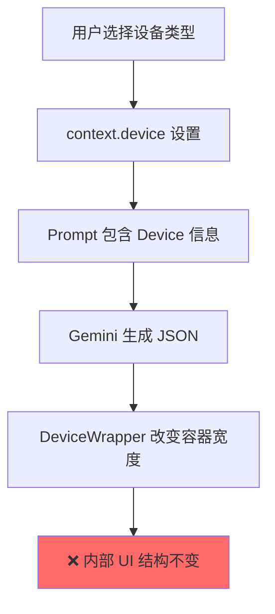

# 📱 响应式设计修复方案

> **文档版本**: v1.0  
> **创建日期**: 2026-01-13  
> **优先级**: 🔴 HIGH

---

## 1. 问题概述

### 当前状态
AI 生成的 UI 界面**不能自动适配设备类型**。虽然用户可以切换 `desktop`/`mobile` 视图，但 Gemini 生成的 JSON UI 结构**没有响应式约束**。

### 影响
- 桌面生成的 UI 在手机框内溢出/挤压
- 手机生成的 UI 在桌面框内过于稀疏
- 用户体验不一致

---

## 2. 根因分析



### 问题点

| 位置 | 文件 | 问题 |
|------|------|------|
| Prompt 约束 | `constants.ts:147` | 只说 "adapt to device" 无具体规则 |
| 组件渲染 | `Container.tsx` | 不接收 device 上下文 |
| 布局切换 | `DeviceWrapper.tsx` | 只改变外框宽度 |

---

## 3. 解决方案

### 方案 A: Prompt 约束增强 (推荐)

在 `constants.ts` 的 `SYSTEM_INSTRUCTION` 中添加严格的响应式规则：

#### [MODIFY] [constants.ts](file:///d:/rag/architect/constants.ts)

```typescript
// 在 SYSTEM_INSTRUCTION 末尾添加
const RESPONSIVE_RULES = `

**RESPONSIVE LAYOUT MANDATE (CRITICAL):**

When generating UI for MOBILE devices:
1. **NEVER** use \`layout: "ROW"\` for containers with >2 children
2. **ALWAYS** prefer \`layout: "COL"\` for main content
3. **bento_container**: Maximum 2 columns, prefer \`colSpan: 2\` full-width cards
4. **split_pane**: Convert to stacked \`layout: "COL"\` container
5. **table**: Limit to 3 columns max, or use horizontal scroll wrapper
6. **chart**: Use full width, aspect ratio 4:3

When generating UI for DESKTOP devices:
1. **Utilize width**: Use \`layout: "ROW"\`, \`layout: "GRID"\` freely
2. **bento_container**: 4-column grid encouraged
3. **split_pane**: Default to \`direction: "ROW"\`
4. **table**: Full columns allowed

**VALIDATION**: Before outputting, verify no horizontal overflow on target device.
`;
```

### 方案 B: 前端布局修正层 (补充)

在 `DynamicRenderer.tsx` 添加布局修正逻辑：

#### [MODIFY] [DynamicRenderer.tsx](file:///d:/rag/architect/components/DynamicRenderer.tsx)

```typescript
// 在渲染前添加布局修正
const adjustLayoutForDevice = (node: UINode, device: 'mobile' | 'desktop'): UINode => {
  if (device === 'mobile') {
    // 将 ROW 布局转为 COL（子元素>2时）
    if (node.container?.layout === 'ROW' && node.container?.children?.length > 2) {
      return {
        ...node,
        container: { ...node.container, layout: 'COL' }
      };
    }
    // split_pane 转为堆叠布局
    if (node.split_pane) {
      return {
        container: {
          layout: 'COL',
          gap: 'GAP_MD',
          children: node.split_pane.children
        }
      };
    }
  }
  return node;
};
```

---

## 4. 具体修改清单

### 4.1 修改 `constants.ts`

| 行号 | 修改类型 | 内容 |
|------|----------|------|
| 320-351 | 扩展 | 在 `SYSTEM_INSTRUCTION` 末尾添加 `RESPONSIVE_RULES` |

### 4.2 修改 `DynamicRenderer.tsx`

| 行号 | 修改类型 | 内容 |
|------|----------|------|
| 新增 | 添加 | `adjustLayoutForDevice` 函数 |
| 渲染处 | 修改 | 调用修正函数后再渲染 |

### 4.3 修改组件 (可选)

| 组件 | 修改 |
|------|------|
| `Container.tsx` | 添加 `device` prop，动态调整 `layout` |
| `BentoContainer.tsx` | 手机端强制 2 列 |
| `SplitPane.tsx` | 手机端转为堆叠 |

---

## 5. 验证方案

### 5.1 单元测试

```typescript
// tests/responsive.test.ts
describe('Responsive Layout Adjustment', () => {
  it('should convert ROW to COL on mobile when >2 children', () => {
    const node = { container: { layout: 'ROW', children: [{}, {}, {}] }};
    const result = adjustLayoutForDevice(node, 'mobile');
    expect(result.container.layout).toBe('COL');
  });
  
  it('should keep ROW on desktop', () => {
    const node = { container: { layout: 'ROW', children: [{}, {}, {}] }};
    const result = adjustLayoutForDevice(node, 'desktop');
    expect(result.container.layout).toBe('ROW');
  });
});
```

### 5.2 E2E 测试 (Playwright)

```typescript
test('mobile UI should not have horizontal scroll', async ({ page }) => {
  await page.goto('/');
  await page.click('[data-testid="device-mobile"]');
  await page.fill('textarea', 'Create a dashboard with 5 stats');
  await page.press('textarea', 'Enter');
  await page.waitForSelector('[data-testid="dynamic-renderer"]');
  
  const content = page.locator('[data-testid="content-area"]');
  const scrollWidth = await content.evaluate(el => el.scrollWidth);
  const clientWidth = await content.evaluate(el => el.clientWidth);
  expect(scrollWidth).toBeLessThanOrEqual(clientWidth);
});
```

---

## 6. 风险评估

| 风险 | 概率 | 影响 | 缓解措施 |
|------|------|------|----------|
| LLM 忽略约束 | 中 | 高 | 添加前端修正层作为兜底 |
| 布局修正破坏设计意图 | 低 | 中 | 只修正明显溢出场景 |
| 性能影响 | 低 | 低 | 修正逻辑 O(n) 复杂度 |

---

## 7. 实施时间线

| 阶段 | 任务 | 时间 |
|------|------|------|
| 1 | Prompt 约束增强 | 0.5 天 |
| 2 | 前端修正层实现 | 1 天 |
| 3 | 单元测试 | 0.5 天 |
| 4 | E2E 测试 | 1 天 |

**总计**: 3 天

---

*Generated by DocSeer*
