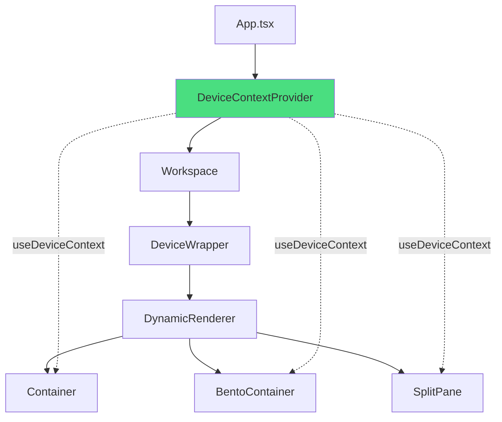

# 🔌 设备上下文注入架构

> **文档版本**: v1.0  
> **创建日期**: 2026-01-13  
> **优先级**: 🔴 HIGH

---

## 1. 问题概述

### 当前状态
所有 UI 组件**不接收 `context.device` 作为 prop**，无法根据设备调整渲染行为。

### 影响
- `layout: "ROW"` 在手机上仍是横向排列
- `bento_container` 在手机上仍是多列网格
- `split_pane` 在手机上仍是左右分割

---

## 2. 解决方案架构

### 方案: React Context 注入

使用 React Context 将设备信息注入到整个组件树：



---

## 3. 具体实现

### 3.1 创建 DeviceContext

#### [NEW] [DeviceContext.tsx](file:///d:/rag/architect/components/DeviceContext.tsx)

```typescript
import React, { createContext, useContext, ReactNode } from 'react';
import { UserContext } from '../types';

interface DeviceContextValue {
  device: 'desktop' | 'mobile';
  isMobile: boolean;
  isDesktop: boolean;
}

const DeviceContext = createContext<DeviceContextValue>({
  device: 'desktop',
  isMobile: false,
  isDesktop: true,
});

interface DeviceProviderProps {
  context: UserContext;
  children: ReactNode;
}

export const DeviceProvider: React.FC<DeviceProviderProps> = ({ context, children }) => {
  const value: DeviceContextValue = {
    device: context.device,
    isMobile: context.device === 'mobile',
    isDesktop: context.device === 'desktop',
  };

  return (
    <DeviceContext.Provider value={value}>
      {children}
    </DeviceContext.Provider>
  );
};

export const useDeviceContext = () => useContext(DeviceContext);
```

### 3.2 修改 App.tsx

#### [MODIFY] [App.tsx](file:///d:/rag/architect/App.tsx)

```typescript
// 在 Workspace 组件中包裹 DeviceProvider
import { DeviceProvider } from './components/DeviceContext';

const Workspace = () => {
  const { state, actions, refs, history } = useGenUI();
  const { context /* ... */ } = state;

  return (
    <DeviceProvider context={context}>
      {/* 原有内容 */}
    </DeviceProvider>
  );
};
```

### 3.3 修改 Container.tsx

#### [MODIFY] [Container.tsx](file:///d:/rag/architect/components/ui/Container.tsx)

```typescript
import { useDeviceContext } from '../DeviceContext';

export const Container = ({ children, layout = 'COL', gap, padding, /* ... */ }: any) => {
  const { isMobile } = useDeviceContext();
  const { theme } = useTheme();

  // 🔧 设备自适应逻辑
  const adaptedLayout = isMobile && layout === 'ROW' && children?.length > 2
    ? 'COL'
    : layout;

  const layoutClass = theme.container.layouts[adaptedLayout] || theme.container.layouts.COL;
  // ... 其余逻辑
};
```

### 3.4 修改 BentoContainer.tsx

#### [MODIFY] [BentoContainer.tsx](file:///d:/rag/architect/components/ui/BentoContainer.tsx)

```typescript
import { useDeviceContext } from '../DeviceContext';

export const BentoContainer = ({ children, onAction, path }: any) => {
  const { isMobile } = useDeviceContext();

  // 🔧 手机端限制为 2 列
  const gridCols = isMobile
    ? 'grid-cols-2'
    : 'grid-cols-4';

  return (
    <div className={`grid ${gridCols} gap-4 w-full auto-rows-[minmax(120px,auto)]`}>
      {/* ... */}
    </div>
  );
};
```

### 3.5 修改 SplitPane.tsx

#### [MODIFY] [SplitPane.tsx](file:///d:/rag/architect/components/ui/SplitPane.tsx)

```typescript
import { useDeviceContext } from '../DeviceContext';

export const SplitPane = ({ direction = 'ROW', children, /* ... */ }: any) => {
  const { isMobile } = useDeviceContext();

  // 🔧 手机端强制堆叠
  const adaptedDirection = isMobile ? 'COL' : direction;

  // 渲染逻辑根据 adaptedDirection...
};
```

---

## 4. 修改文件清单

| 文件 | 操作 | 描述 |
|------|------|------|
| `components/DeviceContext.tsx` | 新建 | 设备上下文 Provider |
| `App.tsx` | 修改 | 包裹 DeviceProvider |
| `components/ui/Container.tsx` | 修改 | 添加设备自适应 |
| `components/ui/BentoContainer.tsx` | 修改 | 手机端 2 列限制 |
| `components/ui/SplitPane.tsx` | 修改 | 手机端堆叠布局 |
| `components/ui/Table.tsx` | 修改 | 手机端横向滚动 |

---

## 5. 验证方案

### 5.1 单元测试

```typescript
// tests/device-context.test.tsx
import { render, screen } from '@testing-library/react';
import { DeviceProvider } from '../components/DeviceContext';
import { Container } from '../components/ui/Container';

describe('DeviceContext', () => {
  it('should adapt ROW layout to COL on mobile', () => {
    render(
      <DeviceProvider context={{ device: 'mobile', role: 'user', theme: 'dark' }}>
        <Container layout="ROW">
          <div>1</div><div>2</div><div>3</div>
        </Container>
      </DeviceProvider>
    );
    
    const container = screen.getByTestId('container');
    expect(container).toHaveClass('flex-col');
  });
});
```

### 5.2 手动验证步骤

1. 启动开发服务器: `pnpm dev`
2. 切换到 Mobile 视图
3. 输入 "Create a dashboard with 5 stat cards in a row"
4. 验证生成的 UI 是否自动转为列布局
5. 切换到 Desktop 视图
6. 验证 UI 恢复为行布局

---

## 6. 实施时间线

| 阶段 | 任务 | 时间 |
|------|------|------|
| 1 | 创建 DeviceContext | 0.5 天 |
| 2 | 修改 App.tsx | 0.25 天 |
| 3 | 修改组件 (Container, Bento, SplitPane) | 1 天 |
| 4 | 单元测试 | 0.5 天 |
| 5 | 集成测试 | 0.5 天 |

**总计**: 2.75 天

---

*Generated by DocSeer*
