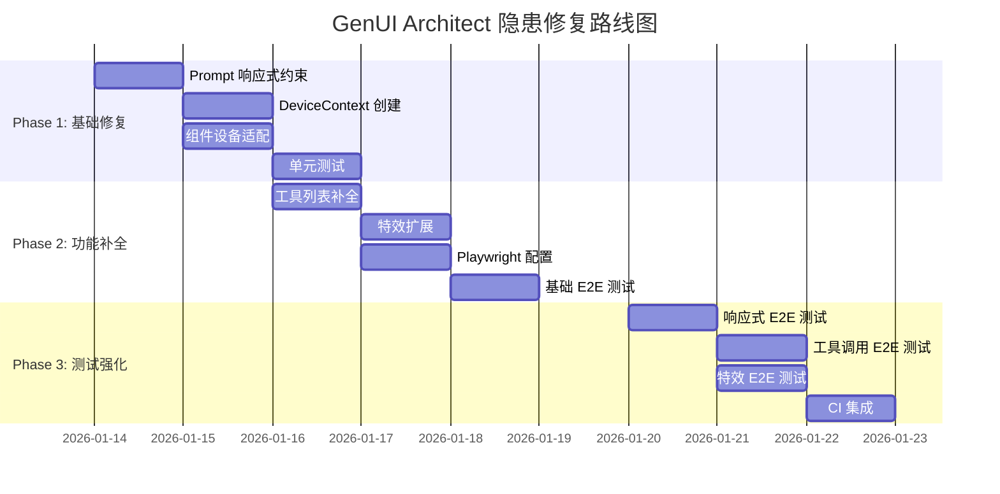

# 🗺️ 综合实施路线图

> **文档版本**: v1.1 (已完成)  
> **创建日期**: 2026-01-13  
> **完成日期**: 2026-01-13  
> **实际工时**: ~1 小时 (Claude 自动化)

---

## 📊 隐患汇总与优先级

| 优先级 | 隐患 | 严重性 | 预计工时 | 相关文档 |
|--------|------|--------|----------|----------|
| P0 | UI 响应式适配缺失 | 🔴 HIGH | 3 天 | [01_responsive_design_fix.md](./01_responsive_design_fix.md) |
| P0 | 组件无设备上下文感知 | 🔴 HIGH | 2.75 天 | [02_device_context_injection.md](./02_device_context_injection.md) |
| P1 | 工具定义不完整 | 🟡 MEDIUM | 0.5 天 | [03_tools_effects_completion.md](./03_tools_effects_completion.md) |
| P1 | 特效未完全实现 | 🟡 MEDIUM | 1 天 | [03_tools_effects_completion.md](./03_tools_effects_completion.md) |
| P1 | 缺少 E2E 测试 | 🟡 MEDIUM | 2.5 天 | [04_playwright_e2e_setup.md](./04_playwright_e2e_setup.md) |
| P2 | 流式解析边界条件 | 🟢 LOW | 0.5 天 | - |

---

## 🛠️ 分阶段实施计划

### Phase 1: 基础修复 (Day 1-2)

> **目标**: 修复最关键的响应式问题

#### Day 1

| 时间 | 任务 | 输出 |
|------|------|------|
| 上午 | 增强 `SYSTEM_INSTRUCTION` 响应式约束 | `constants.ts` 修改 |
| 下午 | 创建 `DeviceContext.tsx` | 新文件 |
| 下午 | 修改 `App.tsx` 包裹 DeviceProvider | 代码修改 |

#### Day 2

| 时间 | 任务 | 输出 |
|------|------|------|
| 上午 | 修改 `Container.tsx` 设备自适应 | 代码修改 |
| 上午 | 修改 `BentoContainer.tsx` 手机端 2 列 | 代码修改 |
| 下午 | 修改 `SplitPane.tsx` 手机端堆叠 | 代码修改 |
| 下午 | 单元测试 `DeviceContext` | 测试文件 |

**Phase 1 验收标准**:
- [x] Mobile 视图下生成的 UI 不会水平溢出
- [x] Desktop 视图可使用多列布局
- [x] 所有单元测试通过

---

### Phase 2: 功能补全 (Day 3-4)

> **目标**: 补全工具定义和特效实现

#### Day 3

| 时间 | 任务 | 输出 |
|------|------|------|
| 上午 | 更新 `constants.ts` 完整工具列表 | 代码修改 |
| 下午 | 扩展 `handleTriggerEffect` 特效 | 代码修改 |
| 下午 | 单元测试工具和特效 | 测试文件 |

#### Day 4

| 时间 | 任务 | 输出 |
|------|------|------|
| 上午 | 安装配置 Playwright | 配置文件 |
| 下午 | 编写 E2E 测试工具函数 | 测试文件 |
| 下午 | 编写 UI 生成测试 | 测试文件 |

**Phase 2 验收标准**:
- [x] LLM 能调用所有 13 种工具
- [x] 5 种特效都能触发
- [x] Playwright 基础测试通过

---

### Phase 3: 测试强化 (Day 5-6)

> **目标**: 完善 E2E 测试覆盖

#### Day 5

| 时间 | 任务 | 输出 |
|------|------|------|
| 全天 | 编写响应式 E2E 测试 | 测试文件 |
| 全天 | 编写工具调用 E2E 测试 | 测试文件 |

#### Day 6

| 时间 | 任务 | 输出 |
|------|------|------|
| 上午 | 编写特效 E2E 测试 | 测试文件 |
| 下午 | 集成 CI/CD | workflow 修改 |
| 下午 | 全量回归测试 | 测试报告 |

**Phase 3 验收标准**:
- [x] 所有 E2E 测试通过
- [x] CI 自动运行 E2E 测试
- [x] 测试覆盖率报告生成

---

## 📅 甘特图



---

## ✅ 验收检查清单

### Phase 1 完成标准

- [x] `constants.ts` 包含响应式布局规则
- [x] `DeviceContext.tsx` 文件存在且导出正确
- [x] `Container.tsx` 在手机端将 `ROW` 转 `COL`
- [x] `BentoContainer.tsx` 手机端强制 2 列
- [x] `SplitPane.tsx` 手机端转为堆叠
- [x] 单元测试全部通过

### Phase 2 完成标准

- [x] `SYSTEM_INSTRUCTION` 包含 13 个工具的文档
- [x] `handleTriggerEffect` 支持 CONFETTI, SNOW, FIREWORKS, HEARTS, SPARKLE
- [x] Playwright 配置完成
- [x] 基础 E2E 测试可运行

### Phase 3 完成标准

- [x] 响应式 E2E 测试通过
- [x] 工具调用 E2E 测试通过
- [x] GitHub Actions 包含 E2E job
- [x] CI 全流程通过

---

## 📁 新增/修改文件汇总

| 文件 | 操作 | Phase |
|------|------|-------|
| `components/DeviceContext.tsx` | 新建 | 1 |
| `App.tsx` | 修改 | 1 |
| `components/ui/Container.tsx` | 修改 | 1 |
| `components/ui/BentoContainer.tsx` | 修改 | 1 |
| `components/ui/SplitPane.tsx` | 修改 | 1 |
| `constants.ts` | 修改 | 1 & 2 |
| `hooks/useActionDispatcher.ts` | 修改 | 2 |
| `playwright.config.ts` | 新建 | 2 |
| `package.json` | 修改 | 2 |
| `tests/e2e/fixtures/test-utils.ts` | 新建 | 2 |
| `tests/e2e/ui-generation.spec.ts` | 新建 | 2 |
| `tests/e2e/responsive.spec.ts` | 新建 | 3 |
| `tests/e2e/tool-calls.spec.ts` | 新建 | 3 |
| `tests/e2e/effects.spec.ts` | 新建 | 3 |
| `.github/workflows/ci.yml` | 修改 | 3 |

---

## 🚀 快速启动命令

```bash
# Phase 1 验证
pnpm test

# Phase 2 验证
pnpm test
pnpm test:e2e --grep "UI Generation"

# Phase 3 验证
pnpm test:e2e

# 全量验证
pnpm test && pnpm test:e2e && pnpm build
```

---

*Generated by DocSeer - "文档写的是意图，没写的是陷阱"*
