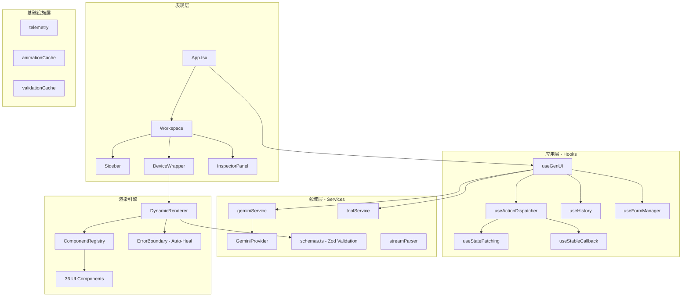
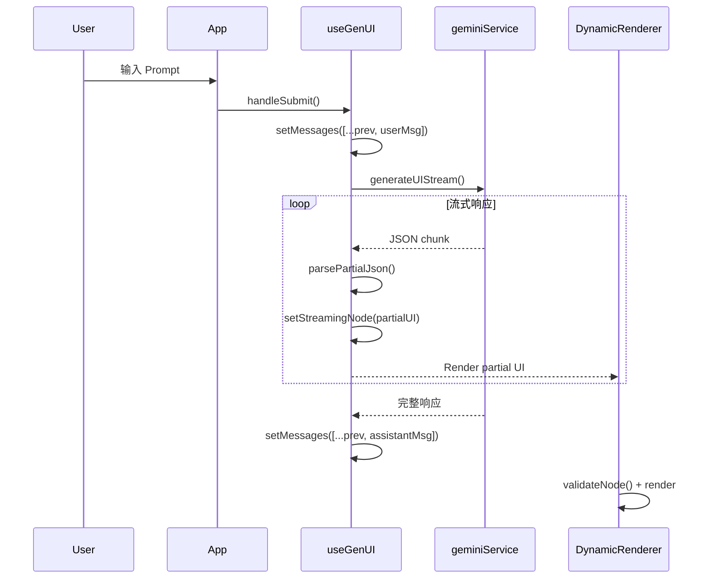
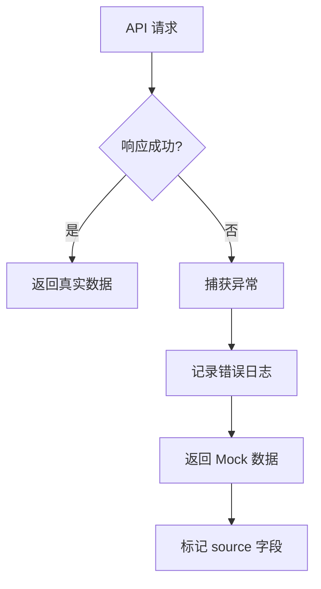

# 架构概览

> **项目名称**: GenUI Architect  
> **复刻日期**: 2026-01-13  
> **源码版本**: v0.0.0

## 技术栈

| 层级 | 技术 | 版本 |
|------|------|------|
| **框架** | React | ^19.2.0 |
| **构建工具** | Vite | ^6.2.0 |
| **语言** | TypeScript | ~5.8.2 |
| **样式** | Tailwind CSS | ^3.4.19 |
| **AI SDK** | @google/genai | ^1.30.0 |
| **动画** | Framer Motion | ^11.0.0 |
| **图表** | Recharts | ^3.5.0 |
| **验证** | Zod | ^3.22.4 |
| **测试** | Vitest | ^2.0.0 |

---

## 系统拓扑



---

## 核心设计模式

### 1. Clean Architecture (清洁架构)

项目采用分层架构，依赖方向从外向内：

```
Presentation → Application → Domain → Infrastructure
     ↑              ↑           ↑
   App.tsx      useGenUI   geminiService
```

### 2. Handler Registry Pattern (处理器注册表)

`useActionDispatcher.ts` 使用模块级别的纯函数处理器，避免闭包重建：

```typescript
// 模块级别定义，创建一次
const HANDLER_REGISTRY: Record<string, ActionHandler> = {
    'SEQUENCE': handleSequence,
    'DELAY': handleDelay,
    'NAVIGATE': handleNavigate,
    // ... 12+ handlers
};

// Hook 内 O(1) 分发
const handler = HANDLER_REGISTRY[action.type];
await handler(action, ctx);
```

**优势**: 减少 ~30% GC 压力

### 3. Error Boundary with Auto-Heal (自愈边界)

`DynamicRenderer.tsx` 包含 React Error Boundary，捕获渲染错误后调用 `fixComponent()` 自动修复：

```typescript
componentDidCatch(error: Error) {
    if (this.props.onError) {
        this.props.onError(error, this.props.node, this.props.path);
    }
}
```

### 4. Streaming JSON Parser (流式 JSON 解析)

`streamParser.ts` 支持解析不完整的 JSON 片段，实现实时 UI 预览：

```typescript
// 流式接收: {"container":{"layout":"COL","chi
// 立即可渲染部分 UI，无需等待完整响应
```

### 5. Component Registry (组件注册表)

`Registry.tsx` 使用懒加载和安全加载器：

```typescript
const ComponentRegistry: Record<string, React.FC<any>> = {
  container: Container,
  card: Card,
  // ... 26+ components
  chart: safeLazy(() => import('./Chart')),  // 懒加载重型组件
};
```

### 6. Time Travel History (时间旅行)

`useHistory.ts` 实现撤销/重做：

```typescript
// 最多保留 50 步历史
const MAX_HISTORY = 50;

// 原子化状态更新
const setState = useCallback((newState, overwrite = false) => {
    // overwrite: 流式更新时覆盖当前条目
    // 否则: 推入新历史点
});
```

---

## 模块依赖

| 模块 | 依赖 | 职责 |
|------|------|------|
| `App.tsx` | ThemeProvider, ToastProvider, useGenUI | 应用入口，Provider 组合 |
| `useGenUI` | geminiService, toolService, useActionDispatcher | 主编排器，状态管理 |
| `useActionDispatcher` | useStatePatching, useFormManager, confetti | Action 分发与执行 |
| `geminiService` | @google/genai, telemetry | AI 生成，流式响应 |
| `toolService` | 外部 API (Open-Meteo, CoinGecko) | 工具执行，Mock 数据 |
| `DynamicRenderer` | ComponentRegistry, validationCache, animationCache | 递归渲染引擎 |
| `schemas.ts` | Zod | UI Node 验证，29 种组件 Schema |

---

## 数据流



---

## 关键配置

### 环境变量

```env
GEMINI_API_KEY=your_api_key_here
```

### Vite 配置要点

```typescript
// vite.config.ts
define: {
  'process.env.API_KEY': JSON.stringify(env.GEMINI_API_KEY)
}
```

### Tailwind 内容扫描

```javascript
// tailwind.config.js
content: [
  "./index.html",
  "./*.{js,ts,jsx,tsx}",
  "./components/**/*.{js,ts,jsx,tsx}",
  "./hooks/**/*.{js,ts,jsx,tsx}",
  "./services/**/*.{js,ts,jsx,tsx}",
]
```

---

## API 弹性策略

### 超时配置

| 服务 | 默认超时 | 重试次数 | 降级策略 |
|------|----------|----------|----------|
| **Gemini API** | 30s (流式) | 0 (实时流) | 显示错误提示 |
| **Open-Meteo 天气** | 10s (fetch默认) | 0 | Mock 数据 + `source: "Mock Data"` |
| **CoinGecko 加密货币** | 10s (fetch默认) | 0 | Mock 数据 + `source: "Mock Data (API Unavailable)"` |

### 降级行为



### 代码示例

```typescript
// services/toolService.ts - 降级模式
const fetchRealWeather = async (location: string) => {
  try {
    const response = await fetch(API_URL);
    if (!response.ok) throw new Error('Weather API failed');
    return { ...data, source: "Open-Meteo API (Real-time)" };
  } catch (e) {
    console.error("Weather fetch failed, falling back to mock", e);
    return { ...mockData, source: "Mock Data" }; // 标记降级
  }
};
```

### Mock 数据标识

所有降级到 Mock 的响应会在 `source` 字段中标记:
- `"Mock Data"` - 完全 Mock
- `"Mock Data (API Unavailable)"` - API 失败后降级

> **注意**: 未来可扩展为使用 `AbortController` 实现精确超时控制，并集成指数退避重试。

